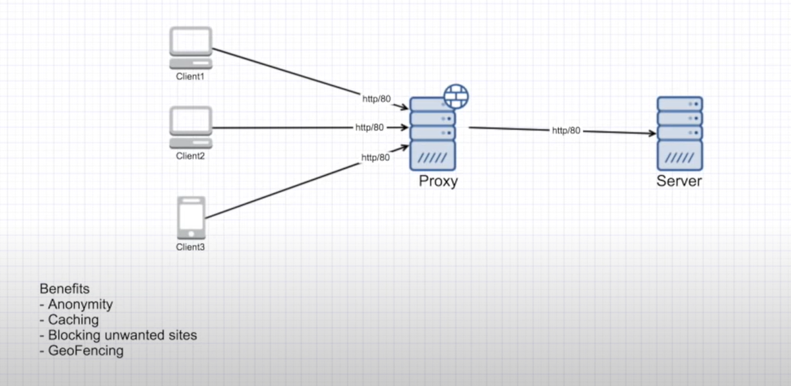
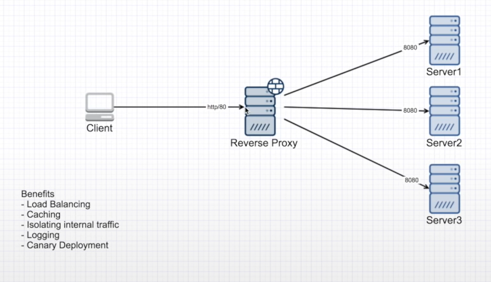

# Proxy servers 
1. A proxy server is between multiple clients and a single main server. So multiple clients connect to the process server and a single proxy server is connected to the main server. The client send the API request to the proxy server and then the proxy server Sands that request to the main server. 
2. **Ananomity** :- as the proxy server is sending the request to the main server, the main server will never know which client request it. So the client will always be anonomous. 
3. **Caching** :- the proxy servers can save some of the websites information in it and when the second time any other client wants the same information it does not send the request to the main server, it by itself gives the response to the client. 
4. **Blocking unwanted sites and using VPN** :- so if any country wants to block any sites it will just say to the proxy server that block this type of side when you received from the clients. So the client will send the API request for the block site, it will go to the and return back with the 404 error. 
5. **Geofencing** :- sudruder proxy servers a particular country can block some of the website that is nothing but geofencing

# Reverse Proxy Servers 

1. Here multiple servers are there and single client is there. So the client will never know which server was 
responsible do give that API request response. The server is anonomous. 
2. **caching** :- even here reverse proxy does caching. It stores some of the API request response and it and just provides it to the client. 
3. Isolating internal traffic a reverse proxy helps in isolating internal traffic by acting as an intermediary between external clients and internal servers it serves as a protective barrier that separate the internal working from the external network this location provide several benefits for security hide internal server details security load balance accessIsolating internal traffic :- 
4. **Logging** :- so the reverse proxy has every information of every main server. If you want to get the information of a particular server you can just go to reverse proxy and get the particular information about the version the server is on and every other information. 
5. **Canary deployment** :- so it happen sometimes like we want a particular server to run on another version. Like a server 1 should work on version 1.1 and the server to should work on version 1.5. We can achieve this by setting one of the sir main server that is server 1 to version 1.1 and other servers to version 1.5 and telling the reverse proxy that if anyone request for the version 1.1 you should give access to main server 1 and for any other request go to server 2 or 3.

   
 
