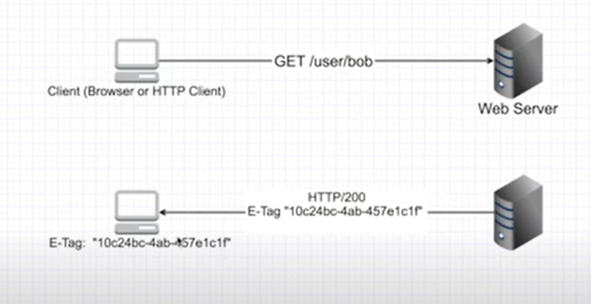
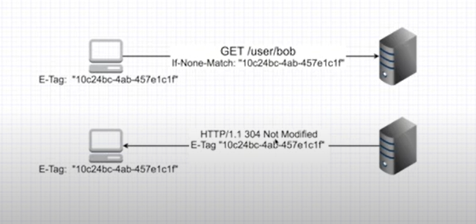
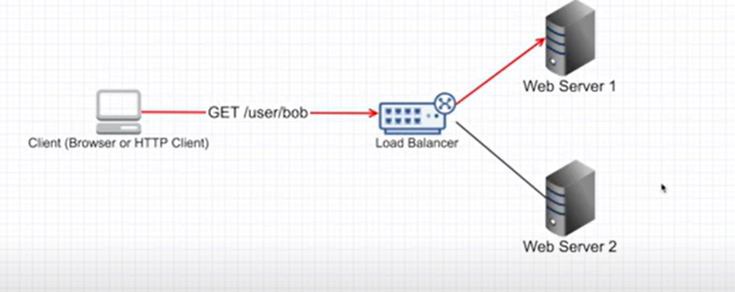
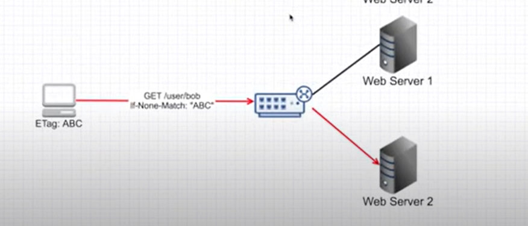
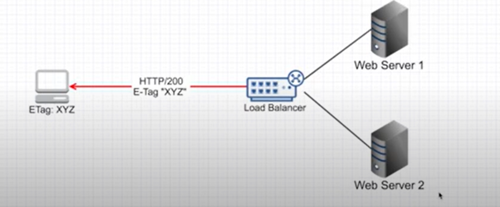

# **E-TAGS**

E-tags (short for Entity Tags) are a mechanism used in web development and HTTP (Hypertext Transfer Protocol) 
to efficiently validate cache data and reduce unnecessary data transfers between the client (usually a web 
browser) and the server. They are a part of the caching infrastructure and help in improving website 
performance and reducing bandwidth usage.

Here's how e-tags work:

1. **HTTP Headers**: When a client makes an HTTP request to a server to retrieve a resource (e.g., an image, CSS file, or webpage), the server responds with the requested resource along with HTTP headers.

2. **E-tag Header**: One of the HTTP headers that the server can include in the response is the "E-tag" header. This E-tag is a unique identifier for the version of the resource that is being returned. It is typically a string or a hash value that represents the content of the resource.

3. **Client-side Caching**: When the client receives the resource along with the E-tag, it stores the E-tag locally.

4. **Subsequent Requests**: If the client wants to request the same resource again, it includes the E-tag value in the "If-None-Match" header of the request. This header tells the server to only send the resource if its E-tag has changed since the last time it was retrieved by the client.

5. **Conditional Requests**: Upon receiving the request with the "If-None-Match" header, the server compares the E-tag value in the request with the current E-tag value of the resource on the server. If the E-tag matches, it means the resource hasn't changed, and the server responds with a "304 Not Modified" status code instead of sending the whole resource again. This saves bandwidth and reduces the server load.

6. **Updated Resources**: If the E-tag value doesn't match, it indicates that the resource has been updated on the server since the last time the client retrieved it. In this case, the server responds with the updated resource along with the new E-tag, and the client updates its local cache with the new E-tag value.

7. E-tags are one of several caching mechanisms in HTTP, and they work together with other cache-related headers like "Cache-Control" and "Last-Modified." By leveraging E-tags and caching, web developers can ensure that clients receive the most up-to-date resources when needed while minimizing unnecessary data transfers and improving overall website performance.

## Advantages 
1. So e-tags can be very useful to control the cache. If you want to check the image which you got from the server is changed or not e tags can be very useful in such a case because it takes very less bandwidth and everything can happen very fast. 

## Disadvantages 
1. Now Let It consider that there is a load balance in between. You request a image from the server 1, and the server 1 has given you tag of 'ABC' now next time you want to check that the images change or not and you send the E tag in the http header which is 'ABC' , but now the load balances sends your http request  another server that is server 2, he does not know of the e tag ABC because it was generated by the server 
    - So according to server 2 the images changed. So it respond with the another E tag 'XYZ' and updated image So hower whole concept of the E-tag just failed. 

2. To solve the above problem, we just have to make a reduce database or any other database where the e-tags art Stored. And we need to make a system that every server will first check the database of the e-tax and then respond. So now server 1 and server 2 will be togetherly knowing the all the e-tags which are generated by every server. And problem solved .

---

1. client asks for content and server sends etags

2. client sends etags to check content changed or not

3. client request server1 for content and server1 prepares etag

4. now loadbalancer sends etag to server 2

5. server 2 responds with new etag that means content changed
