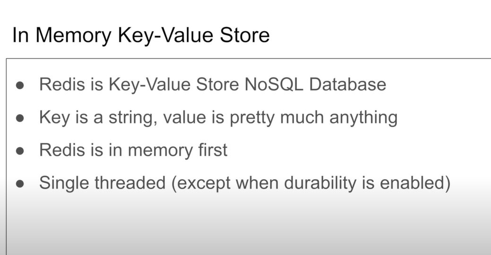
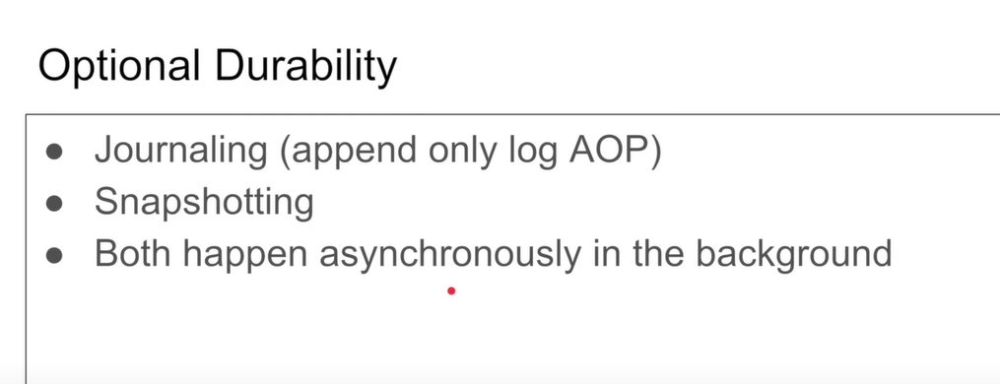
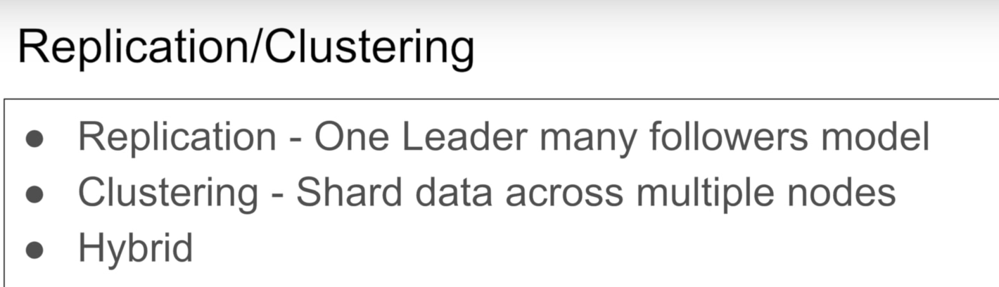

# **Redis** 

 

1. Redis is a key-value store or database. 
2. It is a NOSQL Type of database. That means it does not have any schema. 
3. It is a In-memory database. That means this is the type of database which stores the key value pairs in RAM and not in disk. 
4. Because you are storing the key value pairs in RAM that means it is very faster. The fetching of the data from such type of database Will be very faster. And therefore it is used for caching. 
5. Redis is single threaded in its default configuration. However, despite being single-threaded, Redis can handle a large number of clients and requests concurrently due to its non-blocking I/O and event-driven architecture. Redis uses an event loop to manage multiple client connections without the need for a separate thread for each connection. 

# Data persistence in redis 
  

1. **Snapshotting (RDB - Redis DataBase)** :- 
    - Snapshotting is a mechanism in Redis that allows the system to periodically save its dataset to 
        disk as a snapshot or snapshot file. This snapshot file is essentially a binary representation of the 
        entire dataset at a specific point in time. Redis provides a configuration option to set the frequency
        of snapshotting (how often the snapshots are taken). Snapshotting is usually set up to happen at 
        regular intervals or when a certain number of changes (writes) have occurred.

    - Snapshotting is useful for creating backups and saving the dataset to disk in a compact form. 
        However, since snapshots are taken at specific intervals, there is a risk of losing data that hasn't 
        been saved to disk yet in case of a crash. For example, if you said to the snapshoting that after 
        every two seconds The snapshot should be taken and the system crashed after 1 second then all the 
        right operations which were done in the last one second will be gone.

2. **Journaling (AOF - Append-Only File)** :- 
    - Journaling, specifically the Append-Only File (AOF) persistence mechanism, is another way to achieve
        data persistence in Redis. With AOF, every write operation that modifies the dataset is logged in an 
        append-only file. This log contains a record of all write operations in the order they occurred.

    - The AOF file can be used to reconstruct the dataset even after a crash. It can be replayed to 
        recover the dataset as it was at the last write operation before the crash. This mechanism provides
        more granular persistence compared to snapshotting since every write operation is recorded. 

    
# pub/sub model
 

1. The publish-subscribe (pub/sub) model is a messaging pattern supported by Redis that allows different parts of an application or different applications to communicate with each other in a loosely coupled manner. It enables message broadcasting and asynchronous communication between publishers and subscribers.
2. Publishers:- These are clients that send messages, also known as "publish" messages, to specific channels. A channel is a named messaging channel to which messages are sent. Publishers do not need toknow who the subscribers are; they simply send messages to channels.
3. Subscribers: These are clients that "subscribe" to one or more channels. Subscribers receive messages sent to the channels they are subscribed to. Subscribers can be dynamically added or removed from channels without affecting the functionality of other parts of the system.
4. Here's how the process works:
    - A publisher sends a message to a specific channel.
    - Redis distributes the message to all current subscribers of that channel.
    - Subscribers receive the message and can process it.
5. Pub/sub messaging is typically used for scenarios where components of an application or different applications need to be loosely coupled. Some common use cases for Redis pub/sub include real-time updates, event notification systems, chat applications, and broadcasting messages to multiple clients
6. It's important to note that while Redis pub/sub is a powerful and lightweight messaging system, it doesn't provide the advanced features and guarantees of more complex message brokers like RabbitMQ or Apache Kafka. Redis pub/sub is best suited for use cases where simplicity, speed, and lightweight communication are more important than features like message durability, ordered delivery, and complex routing.