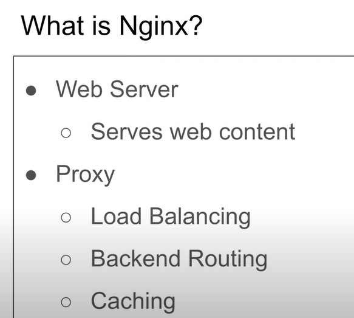
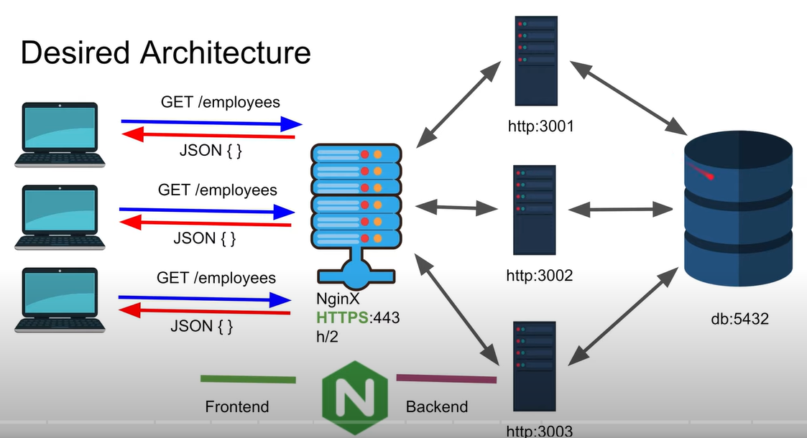
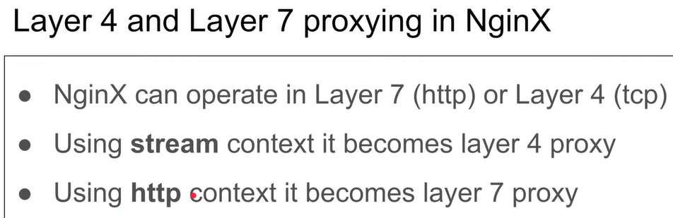

# NGINX 

1. This can be used as a web server and a proxy. In proxy it can be used as Load Balancing, Backend Routing, Caching. 

 
 
# Purpose of NGINX 

1. If we have multiple servers and let's say we have a single database. Every server is interacting with a single database for its queries. Now whenever user hit a server how we are going to decide which server will be choosed and will respond to the request. This is the responsibility of NGINX . 

2. Every server can be on the http port and NGINX can be on the https(443) port. NGINX will be responsible for collecting the request from the front end then choosing the right server on the basis of any algorithm configured by the user(round Robin) and sending the server request for it's fullfilment.

3. This is the place we provide a secure connection to the front end by using the https protocol. And this is the place where we configure the TLS or SSL certificate.

# Layer 4 & Layer 7 proxy

NGINX can be used for both as a proxy in the layer 7 as well as in the layer 4 of OSI layer model.

# Installing on windows
1. download nginx from http://nginx.org/en/docs/windows.html . 
2. extract it in C:/ directory .
3. add the 'c:/nginx' in your system path.
4. Installed and ready to use.

# NGINX as Webserver (web_config.conf)
1. All configuration details are given in the config file . 
2. To run the config file and start the nginx web server . go to 'c:/nginx/' directory and write 'nginx'.
3. To run NGINX  `nginx`
4. To stop the nginx web server `nginx -s stop` . here -s flag is saying that whatever writing next to it is being sent.
5. to reload the chnages do `nginx -s reload` .
6. you can make multiple web servers and manage multiple web servers . becuase wherever it is stored just we need to provide the path in nginx configuration file.

# HTTP server Management (Layer 7)
1. I made 4 sersers at port 2222,3333,4444,5555 . we are going to manage it using nginx.
2. this is a total layer 7 load balancer . means here we can read the http request headers its http method and route and accordinf assign the servers to it.
3. here 1 tcp connection is betweenn frontend and nginx and 4 tcp connections between nginx and 4 backend servers.

# (Layer 4 Proxy)
1. this is a layer 4 proxy that means we are going to manage here TCP connections only. 
2. here if you are using http 1.1/http 1.0 then you can make maximum 6 tcp connections at one server.

# TLS/HTTPS/HTTP2.0
1. It allows us to give the SSL/tls private and the public keys so that we can convert our http into https. Now user will interact with the https on nginx and nginx will interact with the bacon servers by using http. 
2. By default nginx uses TLS 1.2 but we can upgrade it with TLS 1.3 by using nginx. TLS 1.2 is backward compatible but TLS 1.3 is not backward compatible.
3. We can even  use http2 in place of http 1.1 or http 1 . Because http to allows .us to give multiple request at the same time at 1 TCP connection and its secure as well.