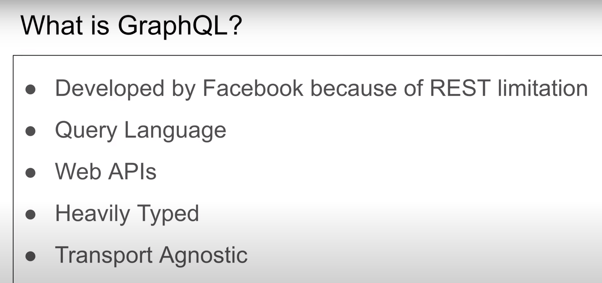
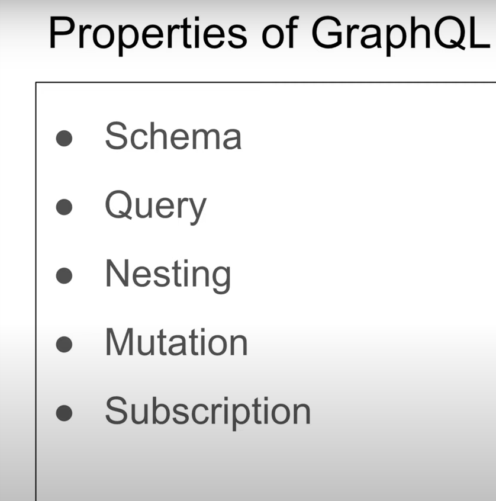

# Graph QL 

1. This is a technology which was developed by Facebook because they wearing need of such a technology. As we know that whenever we try to search a post in a Facebook we get multiple features with that post. Like this poster shown to me because someone has like that I want to get the likes of that post I want to get the comments and its replies on the post. 

2. That means whenever user if we are using rest api then in that get post request the developer needs to very many and API endpoints, like and get post request he needs to make up call to get the likes for that post then even get who other friend has like that post and comments and responses it's a lot of API calls in a single API. 

3. So as we can see that in one query there are multiple queries hidden. This is the reason that Facebook developed graph tool technology which is a query language. Which means that you will use that technology to do multiple queries at a single time. 

4. This is said to be a WEB API , because it was first built on top of http. It is not a compulsion, you can even build graph ql technology on above tCP or udp or web socket protocols. But it is called as a way epi because it was first built on top of http 

5. This is a heavy language which means that it has a schema on contrary rest does not have schema. While writing rest API you can expect anything from there response I mean the data. But why using graph ql the user specifies what he wants. This is a very heavily type then schema based language. 

6. Transport agnostic this means that you can build and use graphical on top of websocket HDP TCP udp on various other protocols. There is not a special language or the special way to send the packets of graphical request it can even travel very smoothly over http. 

# Properties of Graph QL 

1. Schema:

    - A GraphQL schema defines the shape of your API, including the types of data that can be queried and how they are related. It acts as a contract between the client and server.
    - It consists of types, such as objects, scalars, enums, and interfaces, and their relationships (queries, mutations, and subscriptions).
    - The schema provides a clear and structured way to express what data can be requested from the server.

2. Query:

    - Queries are one of the fundamental operations in GraphQL. They are used by clients to request data from the server.
    - A query specifies the shape of the data you want and follows the structure defined in the schema.
    - Clients can request only the specific fields they need, avoiding over-fetching or under-fetching of data.

3. Nesting:

    - GraphQL allows for deeply nested queries, meaning you can request data and its related data in a single query.
    - This enables efficient data fetching and reduces the need for multiple round-trips to the server.
    - Nesting is possible because GraphQL schemas define how different types are related, so you can traverse these relationships in your queries.

4. Mutation:

    - Mutations are used when you want to modify or create data on the server.
    - Unlike queries, mutations are used for write operations, such as adding a new record, updating existing data, or deleting data.
    - Mutations ensure data integrity and allow clients to change the server's state.

5. Subscription:

    - Subscriptions are a way to enable real-time communication between the server and clients.
    - They allow clients to receive updates when data changes on the server without having to send repeated requests.
    - Subscriptions are often used for building features like chat applications, live notifications, or any scenario where real-time updates are needed.

# Implementation

1. First you make a get request to get all the schemas than all the object types of the graph ql . Here we use the github api. So first we made a get request to the github api and get all the necessary object types. This is the only get request now we are only going to send a post request with the graph you are query
