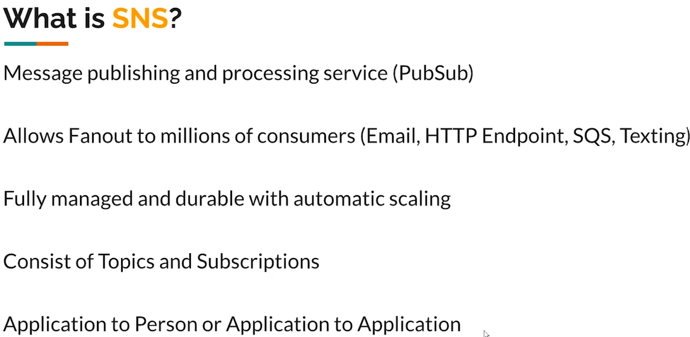
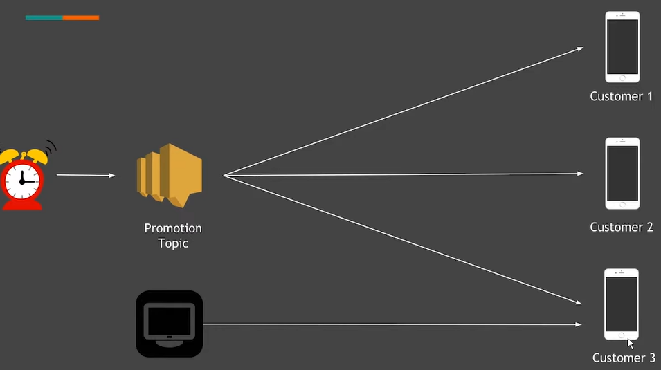
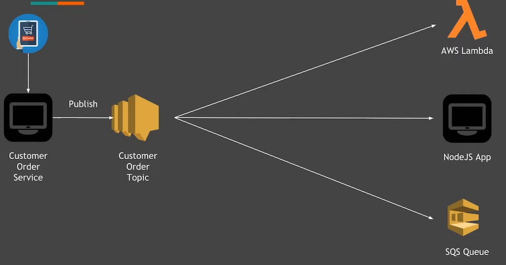

# SNS( simple notification service) 

1. This is a message publishing and processing service following a pubs/Sub Model. 
2. Here we can give a message to the publisher and then he will transfer that message to the one or more consumers. There will be always a one to many relationship. One producer and many consumers. 
3. It is fully managed and auto scale by the AWS. Fully managed means we do not have to manage the infrastructure for it and The Host on which it is hosted. We just need to tell the publisher to publisher to all the consumers that's it. 
4. We can send the messages from application to person that is the application is sending the messages can be email text messages to the person. Or it can also be the application to application messages, which is very highly used in distributed microservices 

# Example :- Application to Person 
 
1. Hear the problem is that we want to send multiple customers the same message. So what we do is we make a topic of the message we want to send there will be only one message. We will make all the customers to subscribe to that topic, and then tell the timer that after every such time this message should be published to all the customers. This is the example of application to person, the messages can be email or SMS. 
2. Here everything is managed by a AWS. 

# Example :- Application to Application
 
1. Hear the customer wants to order something and it interact with the customer order service API. We want that whenever this API is hit and someone places and order some other services should run automatically. What we can do is we can publish this message to a topic named customer order topic. 
2. And then this topic will be responsible for publishing this message to all the services it could be AWS Lambda and another nodejs app or SQS service. 
3. By sending it to AWS lamda we can automatically runs some code by which is serverless. 
4. There maybe a question arises. Why do we need the topic , is it not possible to directly send messages from API to the other services? But wait there is a problem, if we directly send the messages from the API to the other services then that API have the responsibility to send the messages to every other service. That API should be responsible for many different task other than it's main task of interacting with the customer. That is the main reason we use the topic and it is a responsibility of the topic to send everyone messages now.

# Encryption of messages 
1. AWS provides us the option to encrypt the messages as well. Basically when we use the AWS SNS service it is actually we are accessing it using an API which is https. So it is encrypted in nature. But if the message which we are sending is highly sensitive data then it should be encrypted by as as well. 
2. Here we do not have to do anything. Whenever we are trying to send the messages it will be encrypted if you enable this option, and when the message will be delivered just before that it will be decrypted and delivered. 

# Access Policy in SNS 
1. While using this service we can set many things, one of the thing is who can published to the topic and who can subscribed to the topic we have control on it. 
2. Various options are provided like everyone can publish and everyone can subscribe or topic owner can publish and everyone can subscribe. There are various options available for it.

# Subscription 
## Subscription Filter poilicy 
1. So here we are filtering the subscription messages. Let's say the publisher is sending two types of messages it is in person message and a www message. Subscriber one wants all the messages so this is simple SNS works in this way by default. 
2. But let's say a subscriber wants only www messages then in this subscription filter policy it can define that it wants only www messages and that's it. Now this subscriber will get only the subscribed messages.