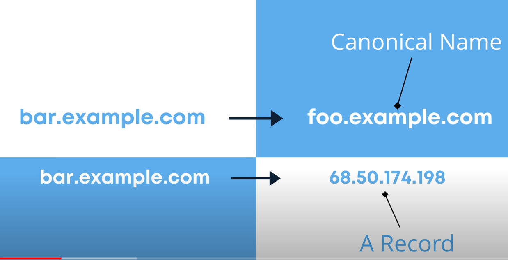

# CName and A Record
1. CName stands for canonical name. It is just an Alias which matches one domain name to another domain name. So if you want to connect two domain names. Then CName Records can be used. 
2. A Records maps domain name to IP address. 
3.  Cname Record :- domain name to domain name
    A Record :- domain name to IP address.

In detail :- https://en.wikipedia.org/wiki/CNAME_record#:~:text=A%20Canonical%20Name%20(CNAME)%20record,another%20(the%20canonical%20name).

# TXT record
1. this is a type of record used to store some txt messages.
2. like we can make a TXT record to dkacademy.co.in and make it to serve some text message.
3. it is used for security authentication of website. like it can be some txt message and any comouter can access the txt message . theereby authentication that yes you are dkacademy.
4. It is also used for spam email security
