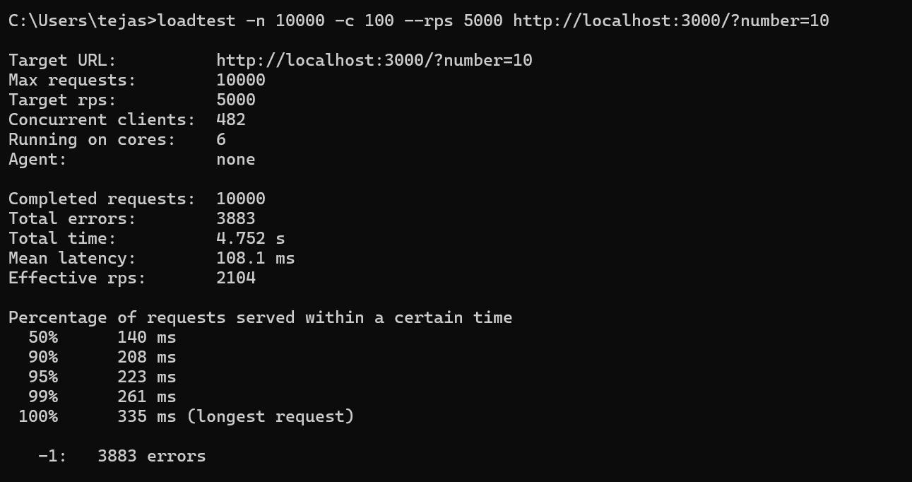

I used loadtest to test both the servers with the cluster and without the cluster.

# 1. the report of without cluster.

# 2. the report of with cluster.
[text](summary.md) 

# summary of reports generated by usjng chat gpt

## 1. Server without Clustering:

    Concurrent clients: 482
    Total completed requests: 10000
    Total errors: 3883
    Total time: 4.752 seconds
    Mean latency: 108.1 milliseconds
    Effective requests per second (rps): 2104
    50th percentile (median) latency: 140 milliseconds
    90th percentile latency: 208 milliseconds
    95th percentile latency: 223 milliseconds
    99th percentile latency: 261 milliseconds
    Maximum latency: 335 milliseconds

## 2. Server with Clustering:

    Concurrent clients: 849
    Total completed requests: 10000
    Total errors: 1195
    Total time: 3.626 seconds
    Mean latency: 73 milliseconds
    Effective requests per second (rps): 2758
    50th percentile (median) latency: 72 milliseconds
    90th percentile latency: 120 milliseconds
    95th percentile latency: 152 milliseconds
    99th percentile latency: 210 milliseconds
    Maximum latency: 250 milliseconds

## Analysis:

1. **Concurrent Clients and Total Completed Requests**: The server with clustering handled more concurrent clients (849 vs. 482) and completed the same number of requests (10000). This indicates that clustering allowed the server to handle more concurrent connections efficiently.

2. **Total Errors**: The server with clustering reported fewer errors (1195 vs. 3883). This suggests that clustering helped in reducing errors, possibly by distributing the load among multiple processes.

3. **Total Time and Effective Requests per Second**: The server with clustering completed the requests faster (3.626 seconds vs. 4.752 seconds) and achieved a higher effective requests per second (2758 vs. 2104). Clustering likely improved overall throughput and reduced response time.

4. **Mean Latency**: The server with clustering exhibited lower mean latency (73 milliseconds vs. 108.1 milliseconds), indicating better responsiveness.

5. **Latency Percentiles**: Both servers showed improvements in latency percentiles with clustering, indicating better performance across the board. The server with clustering consistently outperformed the one without clustering in terms of latency.

In summary, the server with clustering demonstrated superior performance metrics compared to the server without clustering, including lower latency, reduced errors, higher throughput, and better handling of concurrent connections. Clustering effectively leveraged multiple processes to handle the load more efficiently.

## Metrices used :- their meaning

1. **Concurrent Clients**: This refers to the number of users or clients simultaneously accessing the server. In your case, it represents the number of simulated users making requests to the server at the same time during the load test.

2. **Total Completed Requests**: This is the total number of HTTP requests successfully processed and completed by the server during the load test.

3. **Total Errors**: The number of requests that encountered errors or failures during processing. Errors can include various issues such as timeouts, connection failures, or server errors.

4. **Total Time**: The overall duration of the load test, measured from the start until the completion of the last request.

5. **Mean Latency**: Also known as average latency, this is the average time taken for the server to respond to each request. Latency is the delay between the client sending a request and receiving a response from the server.

6. **Effective Requests per Second (rps)**: This represents the actual throughput or number of requests processed by the server per second during the load test. It indicates the server's capacity to handle incoming requests within a specific time frame.

7. **Percentile Latency**: Latency percentiles provide insights into the distribution of response times. For example, the 50th percentile (median) latency indicates that 50% of requests were served within that time or faster. Similarly, the 90th, 95th, and 99th percentile latencies represent the response times for the corresponding percentages of requests.

8. **Maximum Latency**: The longest time taken for the server to respond to any single request during the load test. It represents the worst-case scenario in terms of response time.