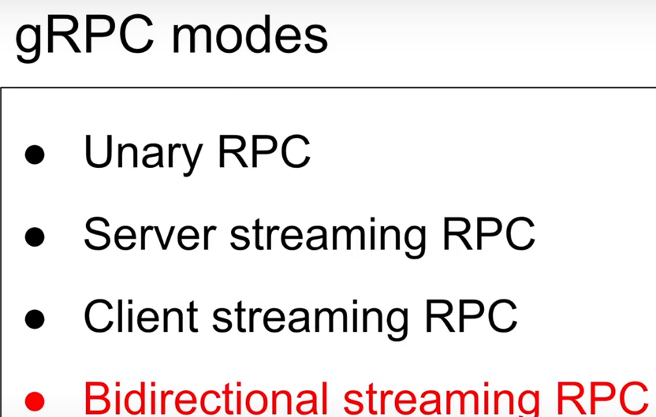

# gRPC

1. It is a replacement for the client side libraries for all the communication between server and client.
2. so what is teh client side library for http, webssocket, graphql and any other communication protocols , it is -----> BROWSER.
3. so what will happen if we want to handle the http request , web sockets rewuqest without browser. we need to prepare our own client side libraries to intercat. it haoppened in different languages differnt client side libraries were developed. http library. the problem is the libraries can be maintianed or not maintained.
4. so google took the responsibility and said that it will build grpc. which will be comprising of all the client side protocols in it. g can be for google.
5. grpc uses http-2 as http version  and protocol buffers as message language.

# gRPC modes
There are 4 modes in gRPC

1. **Unary RPC mode** :- REST . it is just like REST . normal client sends requesy and the server responds with response.
2. **Server streaming** :- SSE. it is just like server sent events. where client hits the server and the server responds with the stream of data continously. ex:- realtime dashboard updates. 
3. **client streaming** :- here the client sends the stream of data to server. it can be used for sending or uploading video.
4. **Bidirectional streaming** :- websockets. here the client and server both can talk and listen at the same time.
