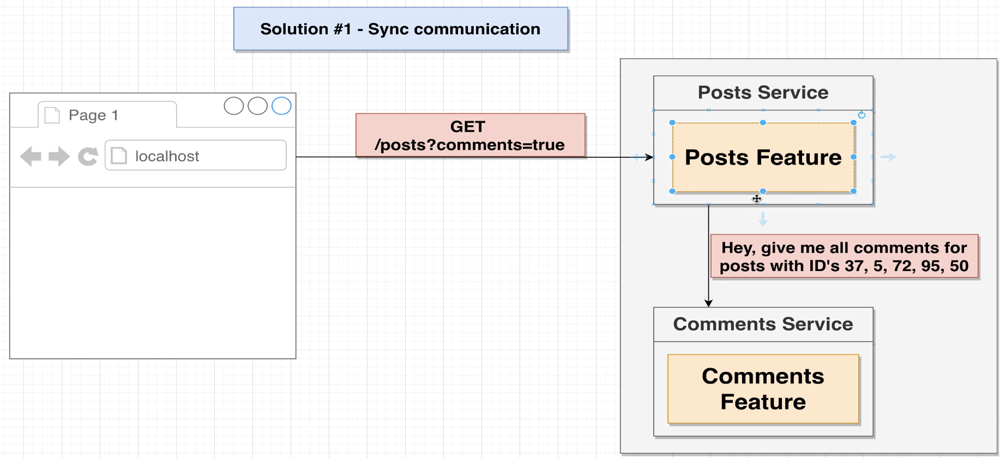
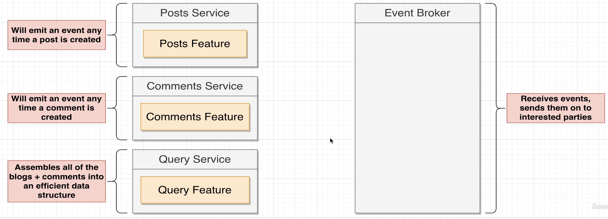
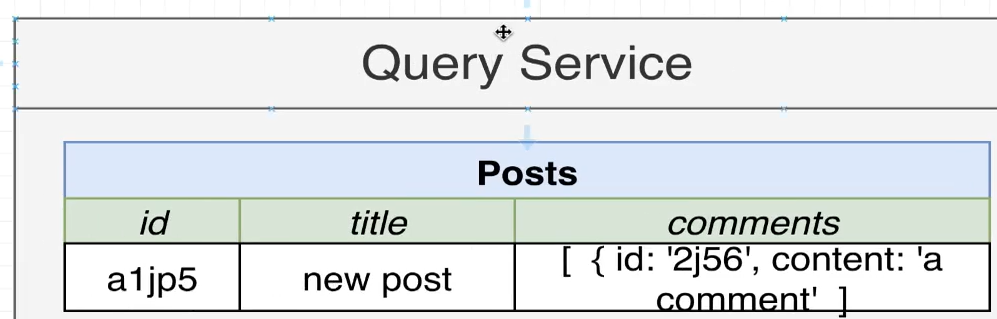
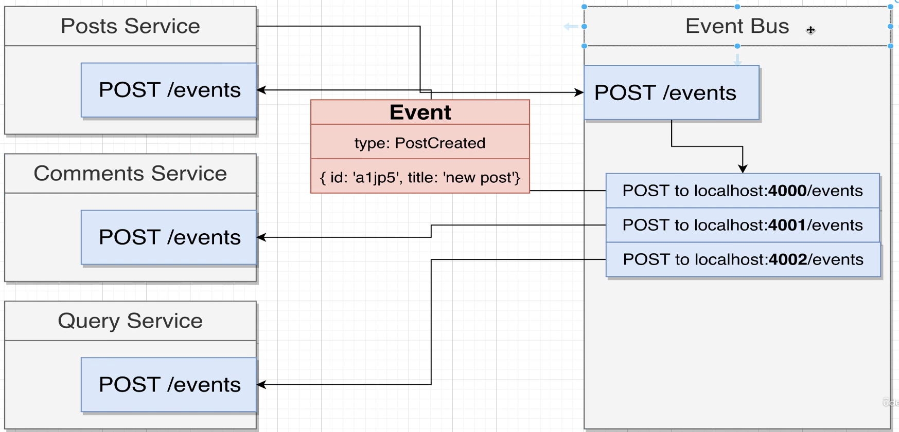
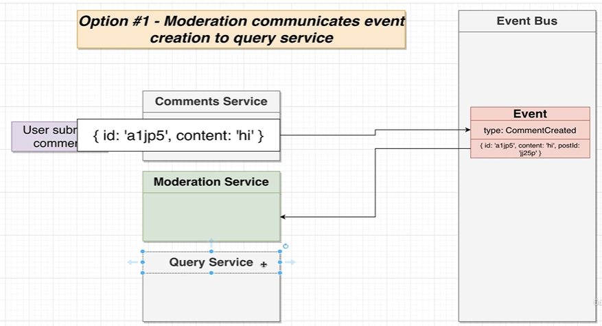

# Posts at 4000 port server
1. GET :- /posts :- to get list of posts with postId.
2. POST :- /posts  BODY:-{postTitle}:-   to create a new post.

# Comments server on port 4001
1. GET :- /posts/:postId/comments :- to get the array of comments for post with PostId.
2. POST :- /posts/:postId/comments :- to create a new comment for post with PostId.

# Initial Summary
1. we use /posts on 4000 to get the list of posts.
2. And to get comments of each posts we hit the /posts/{postId}/comments route.
3. if there are 3 posts with 3 comments each then we end up making 
    1(getAllPosts) + 3*3(3 comments of each post) = 10 request.

# How can we get all the posts and its comments in 1 request b/c we need to show it at a single screen.
1. **_Monolith_** :- it's Very simple with monolith architecture. we take all the posts and map on it and also get comments from comments db. and share it with frontend.
2. **_Microservices_** :- It is dfficult b/c now we have separated posts and comments service.
    1. **Synchrounous way** :- we can make a new api in posts server with ?comments true query. when comments true  is passed the posts server will hit the comments section and the posts with its comments will be given to the user. It introduces a dependency between the servers which is not reliable.
    

    2. **Async Way** :- in this we make a 3rd service called as query service which will give all the posts with the comments to user in a single request. Wheneveyr a new post is created it will tell query service and it will make a entry for new post. then a new comment is added to post the comment service will emit event which is catched by query service and it will add comment to db.  
    
    

# Event Bus implementstion
In this Implementation the evnt bus will listen to event  for creation of new post and comment and it will broadcast it to all the servers.

# comments filtering service
1. we added a new comment service which will identify if there is a word 'orange' in the comment.
2. orange is in the comment ---> rejected.
3. so we will add another field named status :- approved / rejected / pending

## There can be 2 ways to implement this

1. **_Making a new server named moderation service._**
    
    1. In this whenever a new comment is created the comments service will emit the event and it will be received by moderation serrvice.
    2. the moderation service will check it has 'orange' keyword. then it makes a status:"approved/pending/rejected" and emit an event named commentModerated and it will be listened by query service.
    3. the query service will just listen to that event and add the status to comment.
    4. **Problem** :- Now if the moderation service takes time then the query seervice will not get the comment with status from moderation service. so as a result if a user has put the comment and moderation service is slow then it will see nothing , he might think that he has not comment, no instant gratification is  there.

2. **_Making a new server named moderation service. handling it differntly._**
    1. There is a slight modification up there . whenever a new comment is created the event will goto moderation and query service where moderation serevre will do its work, but the query server will have the comment with status pending , hence users can query query server and get the comment with status pending. hence instant gratification is promised.

# what will happen if any service is down.
1. so if everything works by the events . if some service is down then it will not be able to catch the event , hence it will miss it.
2. so we can store the events . whenever event is producded it will come to event bus then we will store all the events in the db.
3. When the service which was down is open again we will send that all events to the service in the stored in the form of queue.
