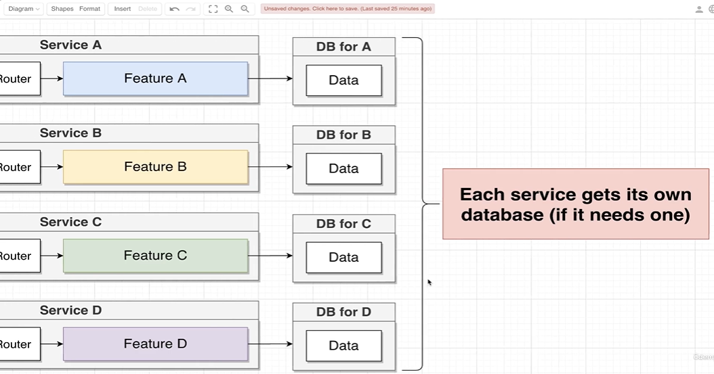
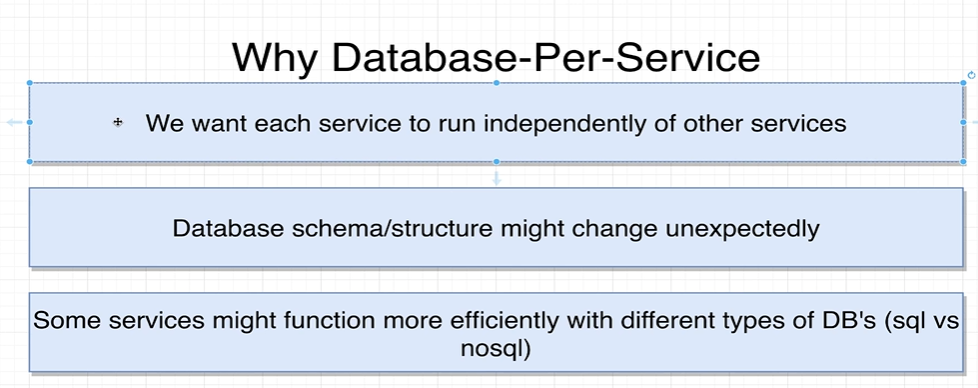
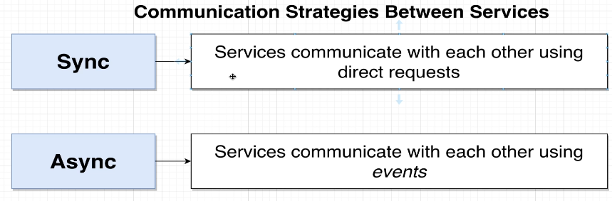
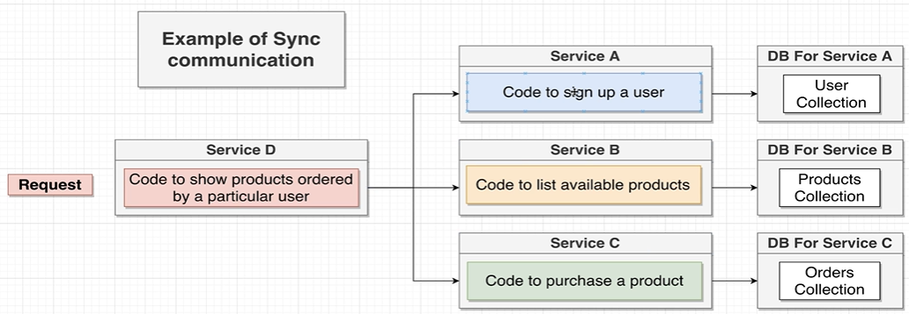
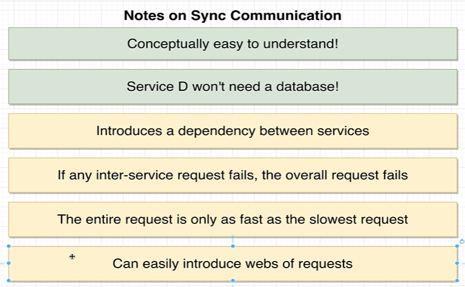
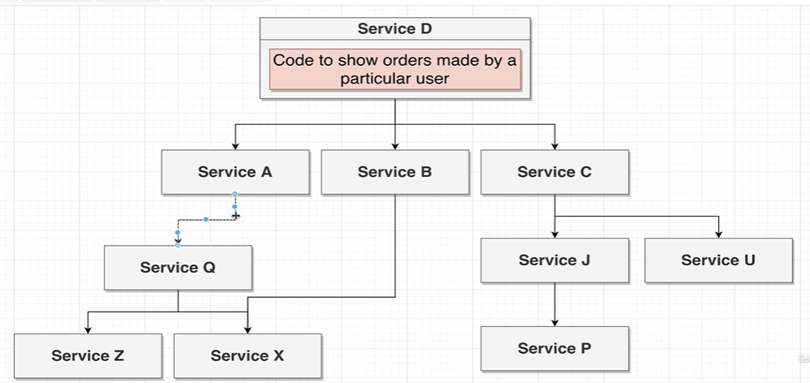
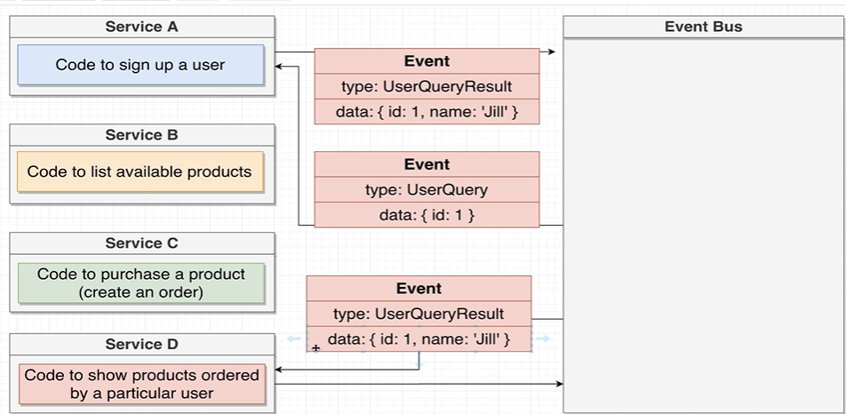
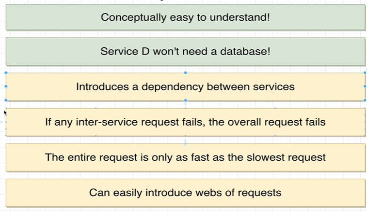
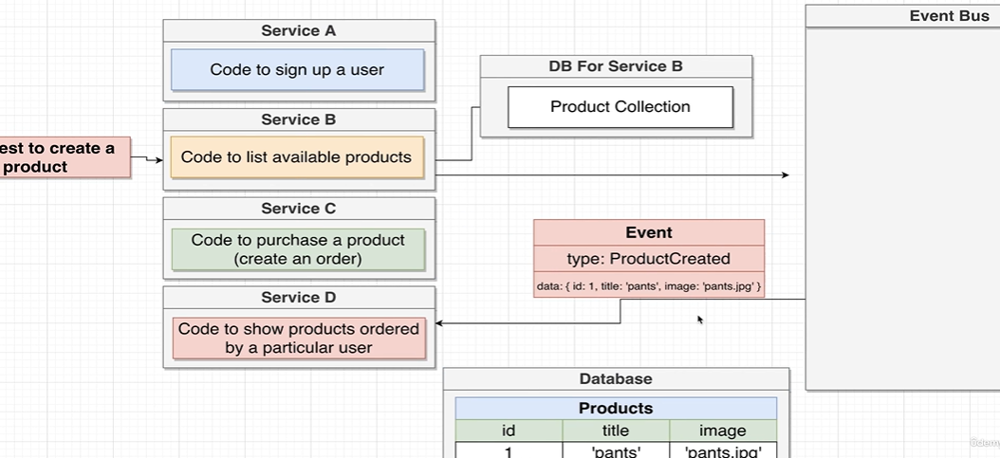
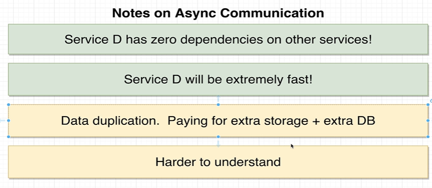

# Microservices (Database-as-service)

1. we should use differnt database for each service . it is called Database-as-service.
2. The Advantages of Database-as-service are :- 

# Sync and Async Communication strategies

## **1. Sync** :- 
 
1.  Here lets say service A,B,C does some work and has separate db.
2. Now if we had a service D which needs to contact the db of all the other services. then using sync messages we can first contact A then B then C individually by using service D and then collect all the information and give the respons eto the client.
3. Advantages and Disadvantages.
 
4. The dependence of one service can increase on other services and it can form of tree of dependency. hence resulting in a very long response time.
 
 

## **2. Async** :- There are 2 ways to acheive it :- 
1. **Every Service is connected to a Event Bus and connects thorugh it.**
    
    1. Lets say servicec A,B,C can work on its own and provide the particular service and service D wants to connect to all the 3 services then service D will connect to event bus with an event with an event name through which event bus reognises what to do with that event. Event bus contacts each other service collects the data and then makes an out event to service D with all the data. So Event Bus is the place where all services contact to get the data.
    2. Advatages and disadvantages 
    

2. **Services tell to Event Bus mainly**
    
    1. In this lets say a new product is created then service B will listen to the request for creating a new product. it will create a new product and store in its personal database. then it sends a event names productCreated to the event Bus and acts as a event producer. All the other services which have subscribed to this event will be trigered and then event bus will pass that event data to the service which has subscribed that event.so event bus will send that event to service D becuase it has subscribed to that event. so the service D will also create a entry for a new product being created. Hence service D separate database will be updated.
    2. In tbis method a new database is required to be created for service D. which will increae the backend work but ultimately the user's response time will be reduced.
    

    