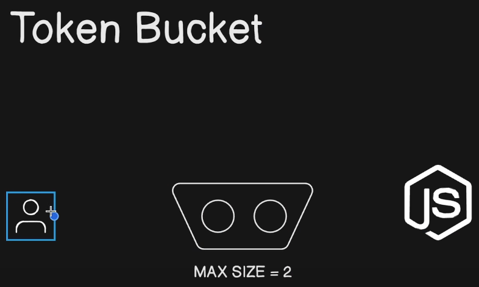
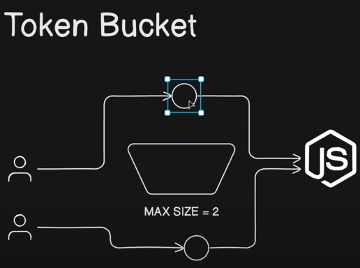
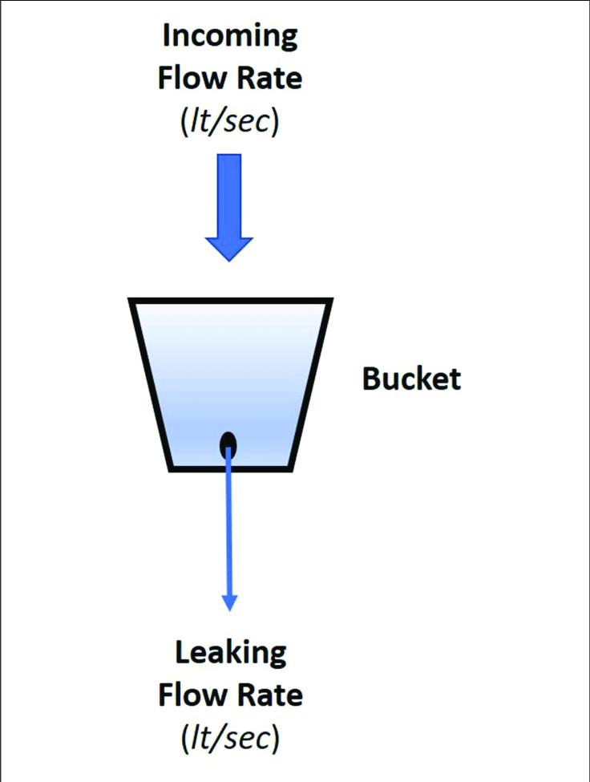

Reference :- https://www.eraser.io/decision-node/api-rate-limiting-strategies-token-bucket-vs-leaky-bucket

# what is Rate Limiting
1. Rate limiting is a technique used in computing and networking to control the amount of traffic or requests sent or received within a specified period of time. It's implemented to prevent servers, services, or networks from being overwhelmed by a flood of requests, which can lead to degraded performance or even complete failure.
2. Rate limiting works by setting thresholds or limits on the number of requests that can be made within a certain timeframe. When the limit is reached, further requests are either delayed, throttled (slowed down), or denied altogether, depending on the specific configuration. 

# Token Bucket Strategy

1. so in this there is a central bucket of tokens between the user and server. The user can request the server if he has token. so a new user comes takes a token from  token bucket and goes to server with the reuqest. herer we can set a max capacity. we can say that if at max 2 tokens are used then 3rd user will wait b/c my server can handle at most 2 request.

## process of token bucket 

1. **Initialization:** When the system starts or the rate limiting mechanism is enabled, the bucket is initialized with a certain number of tokens.
2. **Token replenishment:** Tokens are added to the bucket at a constant rate, often referred to as the token generation rate. This rate determines how quickly the bucket refills with tokens.
3. **Request processing:** When a request or action is initiated, the system checks if there are enough tokens in the bucket to perform the action.If there are sufficient tokens available, the action is allowed, and the appropriate number of tokens are removed from the bucket. If there are not enough tokens available, the action is delayed until there are sufficient tokens in the bucket.
4. **Token consumption:** Each time an action is performed, tokens are consumed from the bucket. The number of tokens consumed may vary depending on the specific implementation and the resource requirements of the action.
5. **Bucket capacity:** The bucket has a maximum capacity, beyond which additional tokens are not added. This prevents the bucket from accumulating an excessive number of tokens during periods of low activity.

# Leaky Bucket Strategy

1. Here there is a bucket which is filled with request of the users. And there is a hole in the bucket from which the request can flow.
2. as soon as the user reuqest the reuest goes to the bucket, and the request get out of the bucket in a controlled fashion from a hole. and the server will only listen to the req coming from that hole and we can control the hole.
