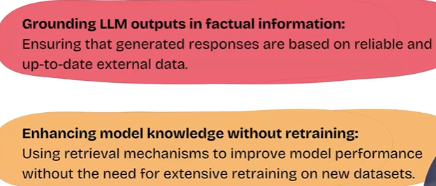

# RAG Fundamentals

1. Retrieval Augmented Generation helps the LLM to get a better context of the query. so we pass the query with the context to the LLM and then the LLM generates the output response.
2. so we can first query the database or anu data source and get the context then attach it with the query and send it to the LLM.
3. Ex :- **perplexity** - searches google and extracts info from it and then send the query and the extracted information to the LLM and get the response from it.

## Core Concepts

## Principles of RAG

1. If LLM is connected to the web as a data source. then the hallucinations or wrong information creation can be avoided.
2. To increase the knowledeg of model. No Fine Tuning , No Retraining just RAG

## Advantages of RAG over Traditional LLM's

So need to increase the knowledge of a model on a specific topics then used RAG , dont retrain and dont fine tune.

